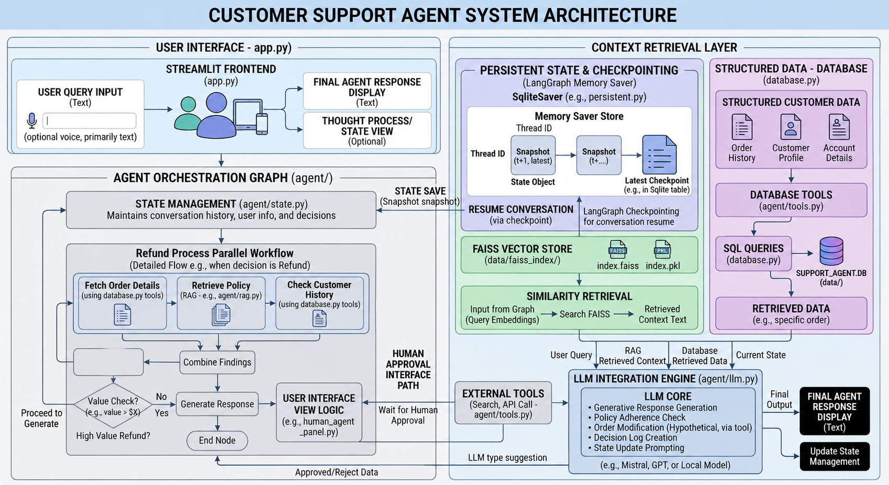
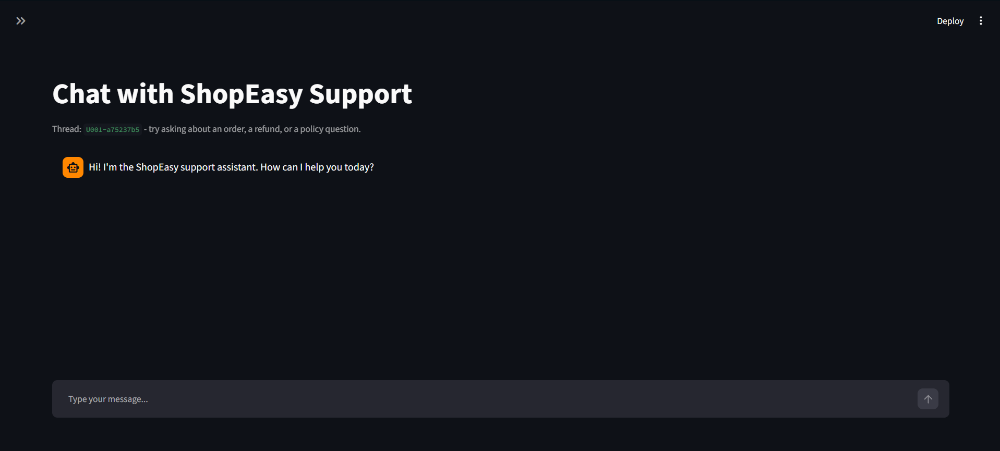
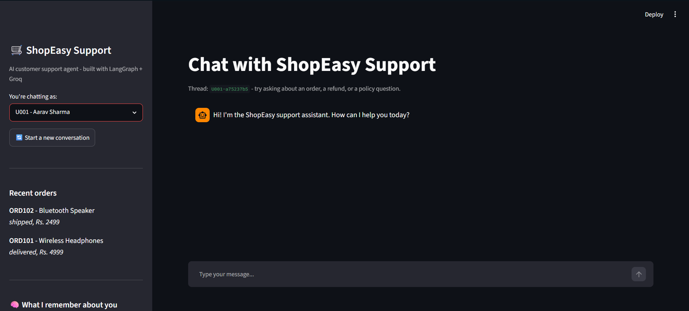
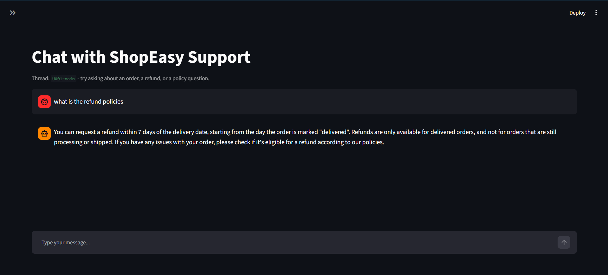
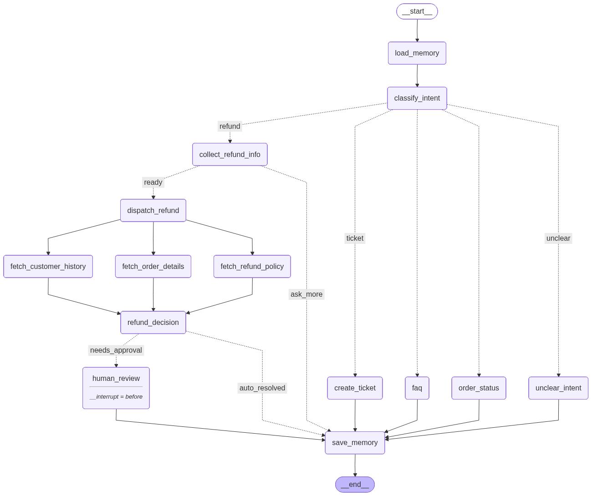

# ShopEasy Support Agent

An AI customer support agent for a (fake) e-commerce store, built with **LangGraph**.
It can answer policy questions using RAG, look up order status, process refund
requests with real business logic, escalate high-value refunds to a human for
approval, and remembers things about each customer across conversations.

Everything in this project is **free** - no paid APIs, no credit card.

### Architecture




### Chat Interface



### Sidebar & Customer Context



### Example Conversation



## What it can do

- **Answer FAQs** about shipping, refunds, and returns using RAG over a small
  policy knowledge base
- **Look up order status** by order ID from a real SQLite database
- **Process refund requests** end-to-end: collect the order ID and reason,
  check eligibility (delivery status, 7-day window, amount), and either
  auto-approve, auto-reject, or send it for human approval
- **Create support tickets** for general complaints or "talk to a human" requests
- **Remember customers** across sessions - e.g. it can recall that a customer
  previously had a delayed delivery complaint
- **Resume conversations** after a restart, because every step is checkpointed


## LangGraph Workflow



---

| Concept | Where it lives |
|---|---|
| Linear workflow | FAQ answering, order status lookup |
| Conditional workflow | Intent routing, auto-approve vs. needs-approval |
| Iterative workflow | Collecting order ID + reason over multiple turns |
| Parallel workflow | Fetching order details, policy, and customer history at once during a refund |
| Tool calling | `agent/tools.py` - order lookup, eligibility check, ticket creation |
| RAG | `agent/rag.py` - FAISS + local embeddings over the policy docs |
| Human-in-the-loop | `interrupt_before=["human_review"]`, manager approves/rejects |
| Persistence / checkpoints | `SqliteSaver` - every step is saved, conversations survive a restart |
| Short-term memory | The graph's `messages` list, scoped to one conversation thread |
| Long-term memory | `customer_memory` table in SQLite, loaded at the start of every turn |
| Streaming | Node-by-node progress + word-by-word reveal of the final answer in the UI |

## Tech stack (100% free)

| Piece | Tool | Why |
|---|---|---|
| LLM | **Groq** `openai/gpt-oss-20b` | Free API, very fast |
| Embeddings | **HuggingFace** `sentence-transformers` | Runs locally, no API key |
| Vector store | **FAISS** | Local file, no server |
| Database | **SQLite** | Built into Python |
| Agent framework | **LangGraph** | Open source |
| UI | **Streamlit** | Free, quick to build |

## Project structure

```
customer-support-agent/
├── app.py                   # Streamlit chat UI - the entry point
├── config.py                 # paths, model names, business rule constants
├── database.py                # SQLite schema, seed data, query helpers
├── setup_database.py          # standalone script: create + seed the database
├── build_knowledge_base.py    # standalone script: build the FAISS index
├── requirements.txt
├── .env.example                # copy to .env and add your free Groq key
│
├── knowledge_base/             # the policy documents RAG searches over
│   ├── faq.md
│   ├── refund_policy.md
│   ├── shipping_policy.md
│   └── return_policy.md
│
├── agent/
│   ├── state.py                # AgentState - the shared state schema
│   ├── llm.py                   # tiny wrapper around ChatGroq
│   ├── rag.py                    # loads FAISS index, retrieves policy chunks
│   ├── tools.py                  # order lookup, refund check, ticket creation...
│   ├── nodes.py                  # every node (step) in the graph
│   └── graph.py                  # wires the nodes into the actual LangGraph graph
│
└── data/                        # created automatically - db files + vector index
```

## Setup

**1. Install dependencies** (a virtual environment is recommended)

```bash
python -m venv venv
source venv/bin/activate        # Windows: venv\Scripts\activate
pip install -r requirements.txt
```

**2. Add your free Groq API key**

```bash
cp .env.example .env
```

Get a free key at [console.groq.com](https://console.groq.com) (sign up, go to
"API Keys", create one) and paste it into `.env`:

```
GROQ_API_KEY=gsk_your_key_here
```

**3. Set up the database and knowledge base**

```bash
python setup_database.py
python build_knowledge_base.py
```

(`build_knowledge_base.py` downloads a small ~90MB embedding model the first
time it runs - after that it works fully offline.)

**4. Run the app**

```bash
streamlit run app.py
```

> Steps 3 actually happen automatically the first time you run `app.py` too,
> if you skip them - they're there mainly so you can run them explicitly and
> talk about them in a demo/interview.

## Demo script

Pick a user from the sidebar and try these:

**FAQ + RAG**
> "What is your refund policy?"
> "How long does shipping take?"

**Order status + tool calling** (try user U001, order `ORD101`)
> "Where is my order ORD101?"

**Refund - auto-approved** (U001, order `ORD101` - delivered recently, under the approval limit)
> "I want a refund"
> *(agent asks for the order ID)* → "ORD101"
> *(agent asks for the reason)* → "it arrived damaged"

**Refund - needs human approval** (U002, order `ORD104` - high value)
> "I want a refund" → "ORD104" → "changed my mind"
> The agent will pause and show an **Approve / Reject** panel in the UI.
> Click Approve and watch the agent resume and confirm the refund.

**Refund - not eligible** (U002, order `ORD103` - delivered over 7 days ago)
> "I want a refund" → "ORD103" → "wrong size"

**Escalation / ticket**
> "I want to talk to a human, this is the third time I've had this issue"

**Long-term memory**
> Click "Start a new conversation" for U002, then ask anything - the sidebar's
> "What I remember about you" panel shows facts saved from earlier sessions,
> even though it's a brand-new chat thread. This is the short-term vs.
> long-term memory distinction in action: a new thread has no chat history,
> but the customer's history in SQLite is still there.

**Resume after a restart**
> Start a refund request, stop midway (e.g. right after giving the order ID),
> restart the Streamlit app, and continue the conversation in the same
> thread - it picks up exactly where it left off, thanks to the SQLite
> checkpointer.


##  A Few Honest Design Notes

>**Hardcoded Routing > LLM Function Calling:** The graph nodes inherently know which tool to use at what stage (e.g., "Got the Order ID? Look it up"). Bypassing the LLM for tool selection drastically improves reliability, especially with free-tier models. Don't worry, the tools themselves are still standard LangChain `@tool` functions!

> **Simulated, Not Raw Streaming:** To keep the logic simple and easy to reason about, the UI mimics streaming. It shows graph progress step-by-step and reveals the final answer word-by-word. Implementing raw token streaming directly from Groq would be a great future enhancement.

> **Keep-It-Simple Refund Logic:** The refund rules (delivered + under 7 days + flat amount threshold) are kept basic on purpose. The goal here is to demonstrate the complex workflow routing, making the logic incredibly easy to explain to recruiters or expand upon later.

---

## Future Improvements


- Better UI uning HTML, CSS , JS or React
- Add an admin dashboard view of all open tickets
- Let the refund eligibility logic consider product category (e.g. final-sale items)
- Hybrid Search (BM25 + FAISS)
- RAGAS (Evaluation Framework)

---
## Author

**Manish Mahara**

B.Tech CSE (AI/ML & Robotics)  
DIT University

GitHub: https://github.com/manishmahara23